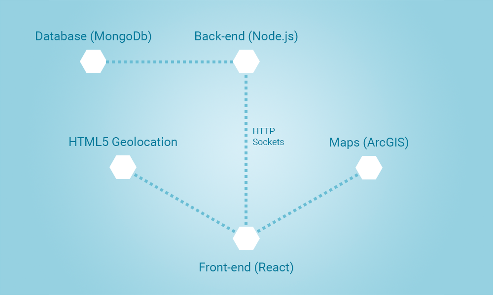

# Find a Donor
A service for finding blood donors near you

* [Tech Stack](#tech-stack)
* [Architecture](#architecture)
* [Tests](#tests)
* [How to Run](#how-to-run)


## Tech Stack
* Language - JavaScript/ES6/ES7/Babel. React components are written on ES6/ES7 using Babel transpiler.
* Back-end - Node.js/Express.js, Mongoose/MongoDB, Socket.io
* Front-end -  React/Flux/React Router/React Toolbox (Material UI), SASS/SCSS/Compass/Breakpoint for CSS
* Maps - Leaflet framework using react-leaflet components, map tiles from ArcGIS service
* Tests - Mocha for API tests

## Architecture
The application is built in client-server architecture with Node.js back-end and React front-end. Also the application utilizes Geolocation API and ArcGIS maps for displaying geo-data.



* User opens main page in a browser.
* Express application serves static React application from `/build` folder.
* If Geolocation API available user will be automatically navigated to his current position on the map.
* User can select any other location by clicking the map.
* User can register as a blood donor by filling the form and clicking `Pin` button.
* His information is stored in MongoDB and will be displayed on the map with other donors.
* After registration a private link will be provided for the user, so he can edit or delete his information later.
* While navigating over the map a data for all visible donors is automatically preloaded.
* User can click on any pin in the map and see the information about the donor: his name, blood group and contact information.
* Contact information is initially hidden from bots and can be easily retrieved by clicking `show` link.

### Data structure
Name | Type | Description
:-- | :-- | :-- 
firstName | String (Non-empty) | Donor's first name.
lastName | String (Non-empty) | Donor's last name.
contactNumber | String (+xx xxx xxxx xxx|00xx xxx xxxx xxx) | Donor's contact phone number.
emailAddress | String (valid email address) | Donor's email address.
bloodGroup | String {0-,0+,A-,A+,B-,B+,AB-,AB+} | Donor's blood group.

### Missing requirements
For better user experience the application can be improved:
* By adding location search bar at the top of the map
* By adding blood group filter for quick filtering donors by their blood group

## Tests

```
$ npm install
$ export MONGODB_CONNECTION=mongodb://<dblogin>:<dbpass>@<dbserver>:<dbport>/<dbname>
$ npm test
```

## How to Run

Using npm:
```
$ npm install
$ npm run build
$ export MONGODB_CONNECTION=mongodb://<dblogin>:<dbpass>@<dbserver>:<dbport>/<dbname>
$ npm start
```

Or using docker:
```
$ docker run -d --name donor -e MONGODB_CONNECTION=mongodb://<dblogin>:<dbpass>@<dbserver>:<dbport>/<dbname> -e DEBUG=find-a-donor:* -p 8080:8080 alexeyernest/find-a-donor
```

Open in your browser
```
http://localhost:8080 
```
